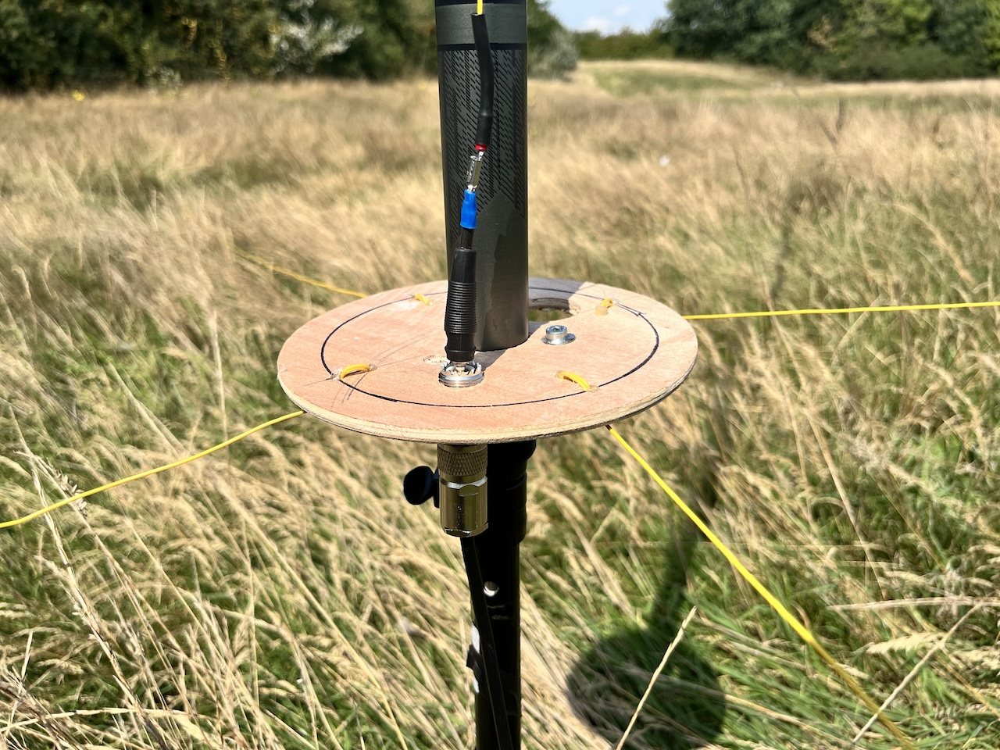
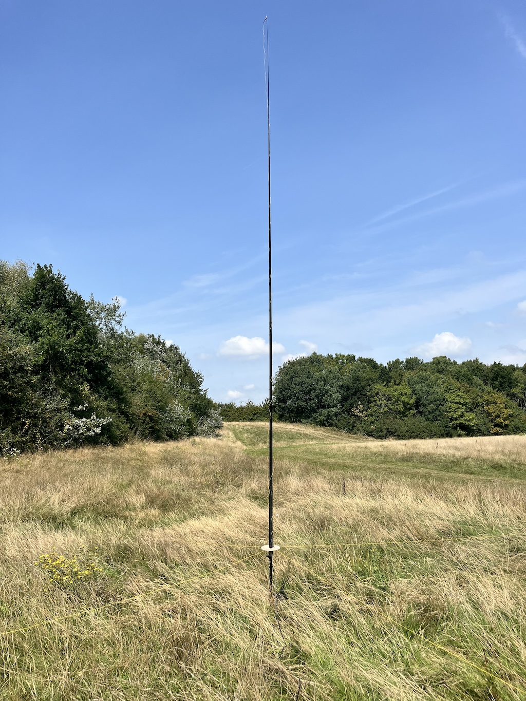
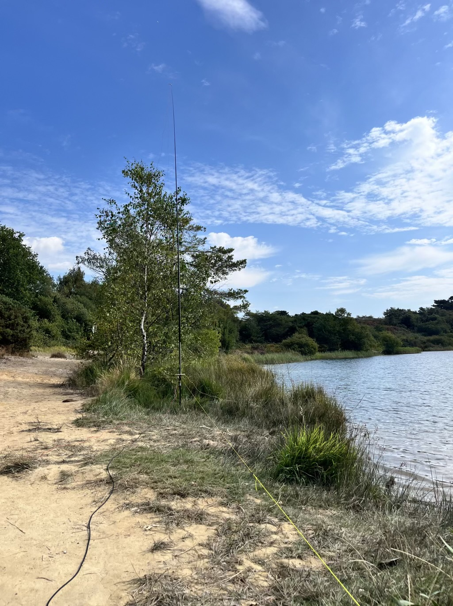
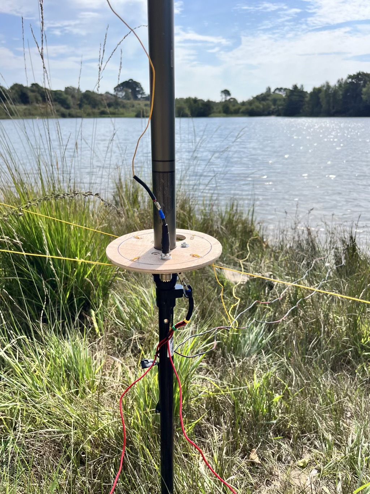
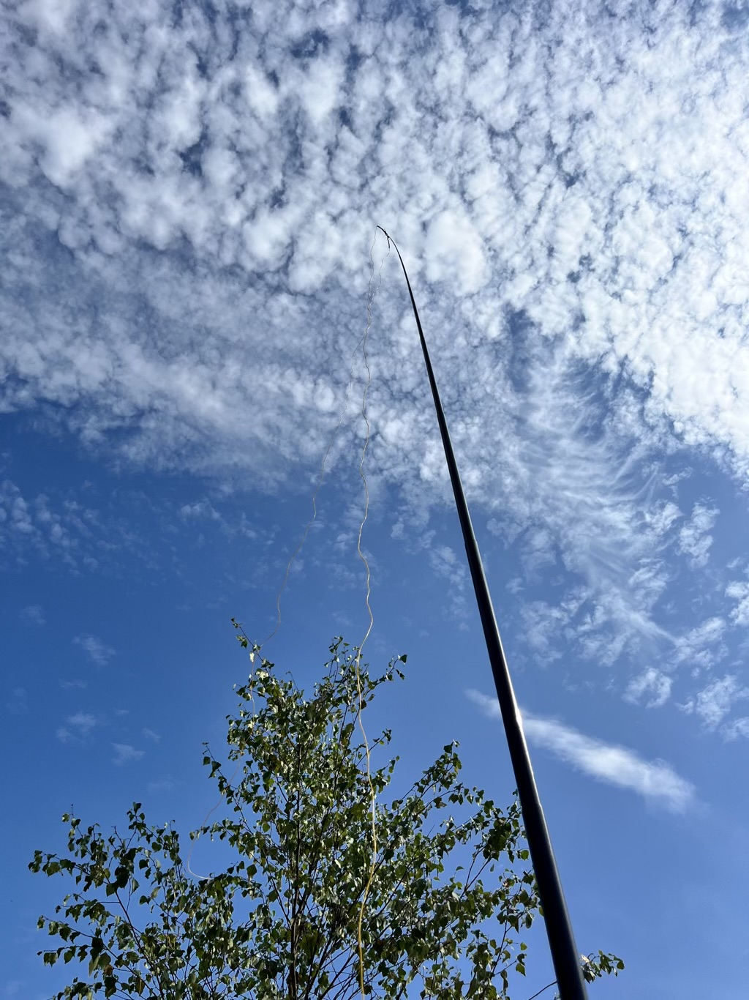

+++
title = "1/4 wave vertical antenna with elevated radials"
date = 2025-08-26
+++

A 1/4 wave vertical antenna with elevated radials.

# Overview

I made my very first contact with a VK station from England using one of these antennas a friend had built. 100 watts, 20 metres and 5/5 both ways around 23:00Z. The next day, I built this antenna for myself from what I had to hand. I do a lot of portable work, so strived for simplicity and lightness. 

This is a resonant antenna for 20 metres- 5m of antenna wire, 5m long radials. It's typically below 1.1 SWR across the band, and due to the elevated radials is very effective. Some sources say elevated radials may be up to 6dB gain compared to equivalent ground radials. In this design, they are also specifically used to guy the mast, making it stable in windy conditions.

# Performance

I normally drive this with a Lab599 TX500 10 watt radio. However, With 60 watts on 40 metres in an inverted L, I've worked Thailand. With 100 watts, Australia on 20 metres. Inverted L / Sloper is quite an NVIS biased anteanna, so I typically get a load of UK stations on 40m in this configuration, again QRP SSB.

Setting up on the beach, 4 elevated radials with one radial almost in the sea, I worked Canada, Virginia in the US, Poland and Gran Canaria using just 10 watts SSB on 20 metres. The wet sand under the elevated radials and the nearby sea is highly effective at getting the signal out. 

# Other bands

I often add another ~5m of wire to the top of the antenna to make a vertical, sloper or inverted L for 40 metres. If I don't have the space to elevate the 10m long radials, I'll add 12 ground radials (8 of 5m and 4 of 10m, as thats what I already have made up) and it'll be under 1.2 SWR on 40m. 

Diagrams and photos below. 

# Component list

- 5m fishing rod pole - [Buy from Decathlon](https://www.decathlon.co.uk/p/lakeside-telescopic-rod-100-6-m/_/R-p-334270?mc=8648725&c=green+olive)
- Bank Stick - this is the corkscrew tipped pole that supports the rod mast - [Buy from Decathlon](https://www.decathlon.co.uk/p/telescopic-spiral-tipped-bankstick/_/R-p-314208?mc=8396654)
- 4 x 2m of guy rope
- 4 x tent pegs
- SO239 chassis connector
- Banana plug
- 3 x crocodile clips
- Circle of rigid material (plastic, plywood, etc) that you can drill holes through
- 25m of wire for a 20m antenna. I use Sotabeams 1.5mm wire for the low weight. It handles 100 watt SSB no problem.
- 4 x 10m radials + 5m more wire to extend the antenna to work 40m. Attach the extra radials with a crocodile clip to the outside of the SO239 connector.

# Build

The radials are cut to exactly 5m long for the 20 metre band. They are wrapped / knotted around two holes in the disc to secure them and then sealed with hot glue for strength. Wire length seems to matter more than effective radiating length. Radials are connected (clipped, soldered, screwed) to the outside of the SO239 connector. 

The antenna wire is soldered to the banana plug, which is then plugged into the top side of the SO239 connector. The other end of the antenna wire, I solder on a crocodile clip. This is used to clip the end of the antenna wire to the top of the mast. When extending the antenna to cover 40m, clip another ~5m of wire on to the crocodile clip at the top of the mast. This can then be:

- Pulled into a tree with a throwline to give you a 40m vertical
- An inverted L using lower branches 
- A sloper when no other supports are available - attach as long a guy line as you can and gently peg or weight it out as far from the mast as you can. The mast will bend very easily, so minimal tension. 

I've used both the Inverted L and Sloper setup succesfully QRP, as well as working DX with 60 watts.

Extend the radials out, tie on a guy line and peg into the ground. Taught enough to keep the radials off the ground, but try not to over tension to avoid stretching the wire. 

For 40m, use 4 x 10m radials. Or if you lack the space, throw down as many radials as you can. 16 total is a good number.  

Run 10m+ of coax out so you're not sitting in the nearfield. Only the antenna wire (not the radials) should need trimming for SWR. A 1:1 SWR is achieveable with little effort.

# Diagrams

View from above. The mast is a 5m fishing rod style telescoping pole from Decathlon. The mast fits through the middle of the wooden disc
and the hole is sized such that the disc rests about at the top of the lowest
 section of the mast. 

The radials are used as guy wires to support the antenna - the end of the
radials are tied onto normal tent guying nylon and then pegged into the ground
with tent pegs. This tension supports the mast and keeps the radials nicely
elevated. 

Click on the image for a larger version:

# Photos

