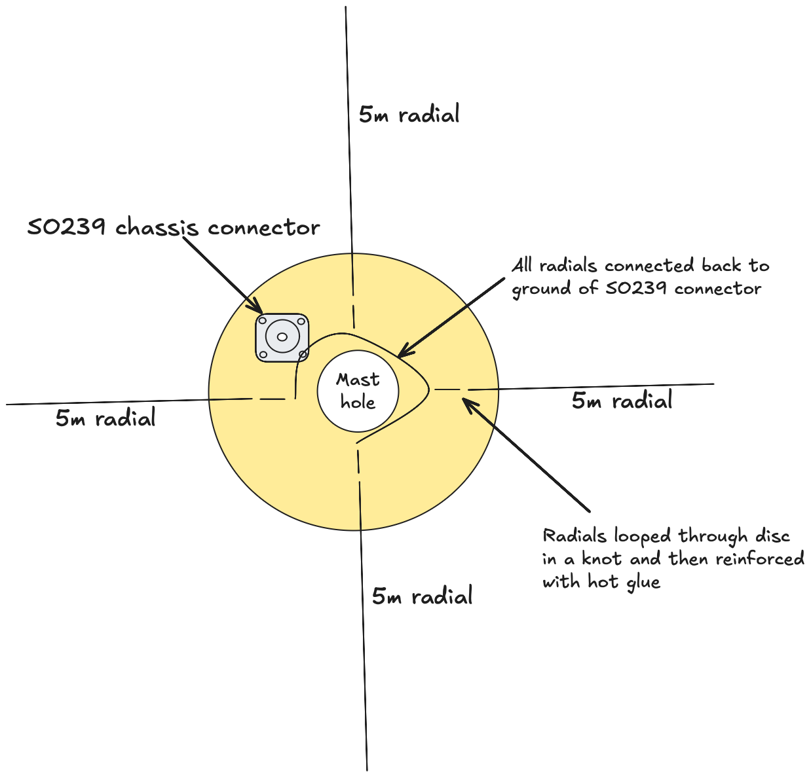
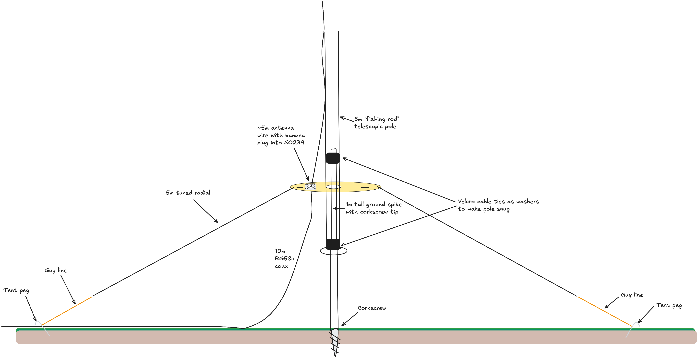

+++
title = "1/4 wave vertical antenna with elevated radials"
date = 2025-08-21
+++

A 1/4 wave vertical antenna with elevated radials for 20m.

View from above. The mast is a 5m fishing rod style telescoping pole from Decathlon. FIXME: insert link. The mast fits through the middle of the wooden disc
and the hole is sized such that the disc rests about at the top of the lowest
 section of the mast. 

The radials are used as guy wires to support the antenna - the end of the
radials are tied onto normal tent guying nylon and then pegged into the ground
with tent pegs. This tension supports the mast and keeps the radials nicely
elevated. 

